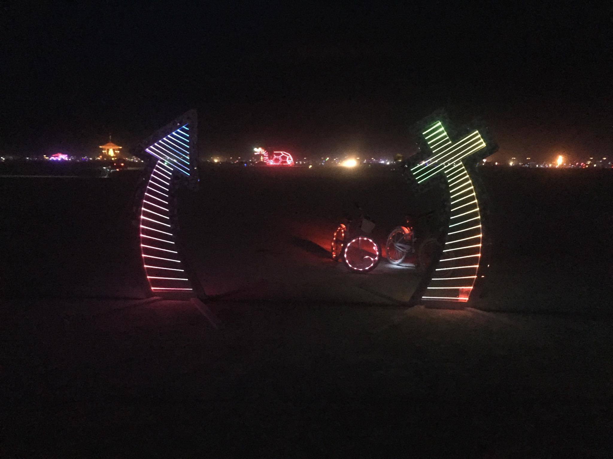

Simulated led strip visualization with SDL2.



More or less portable to Arduino/NeoPixel.

To compile on OSX
```
brew install sdl2_gfx cmake
cmake
make all
./burningman
```

If it fails to link edit `CMakeFiles/burningman.dir/link.txt` append the line with `-L/usr/local/lib`

